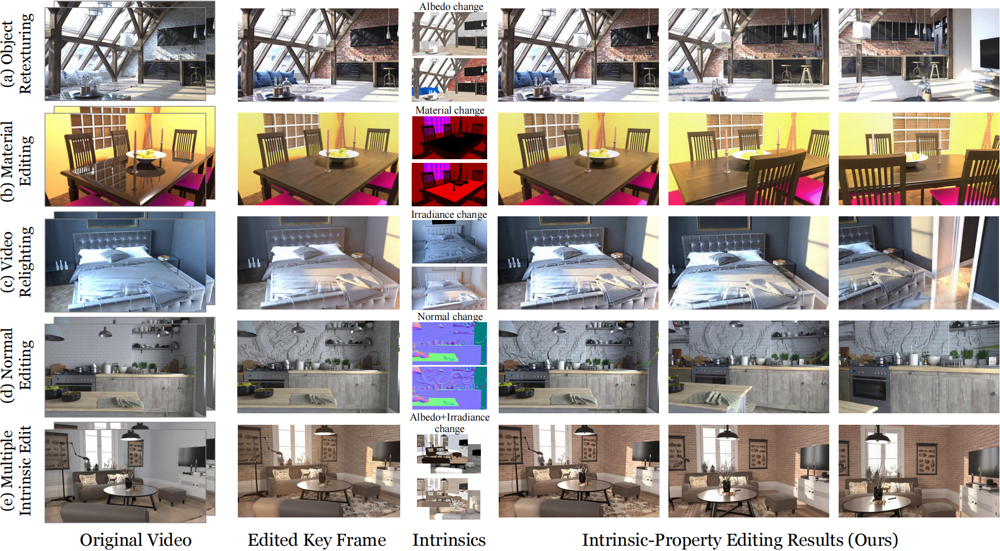

#  V-RGBX: Video Editing with Accurate Controls over Intrinsic Properties 

<!-- **[](https://arxiv.org/abs/2512.16829)** -->


<p align="center">
<a href="https://arxiv.org/abs/xxx">"></a>
<a href="https://aleafy.github.io/vrgbx/"></a>
<a href="https://www.youtube.com/watch?v=j5yGqvB-BP0"></a>

</a>
</p>

[Ye Fang](https://kszpxxzmc.github.io), [Tong Wu✉️](https://wutong16.github.io), [Valentin Deschaintre](https://valentin.deschaintre.fr/), [Duygu Ceylan](https://www.duygu-ceylan.com/), [Iliyan Georgiev](https://iliyan.com/), [Chun-Hao Paul Huang](https://paulchhuang.wixsite.com/chhuang), [Yiwei Hu](https://yiweihu.netlify.app/), [Xuelin Chen](https://xuelin-chen.github.io/), [Tuanfeng Yang Wang✉️](https://tuanfeng.github.io/)

[**Paper**]() | [**Project page**](https://aleafy.github.io/vrgbx/) | [**Video**](https://www.youtube.com/watch?v=j5yGqvB-BP0)





<!-- ## ✨ Updates

## 📦 Install 

## 💡 Inference 

## 📚 Dataset

## 🏋️‍♂️ Training -->

<!-- 🔥 We will release the code and models soon! -->


<!-- ## 🛠️ Usage

### Installation

### Inference -->

## 🔥 News
- 🚀 [Dec 15, 2025] The [paper]() and [project page](https://aleafy.github.io/vrgbx/) are released!

## 📝 Todo
- [ ] Open-source pretrained models & weights
- [ ] Intrinsic-conditioned video editing inference
- [ ] Inverse rendering (RGB → X) inference
- [ ] Forward rendering (X → RGB) inference
- [ ] Inverse Renderer training code
- [ ] Forward Renderer training code


<!-- ## 📚 Acknowledgements
This work is built on many amazing research works and open-source projects, thanks a lot to all the authors for sharing!
- []() -->

## ✒️ Citation
If you find our work helpful for your research, please consider giving a star ⭐ and citation 📝

```bibtex
@article{fang2025vrgbx,
      author    = {Fang, Ye and Wu, Tong and Deschaintre, Valentin and Ceylan, Duygu and Georgiev, Iliyan and Huang, Chun-Hao Paul and Hu, Yiwei and Chen, Xuelin and Wang, Tuanfeng Yang},
      title     = {V-RGBX: Video Editing with Accurate Controls over Intrinsic Properties},
      journal   = {arXiv preprint arXiv: TBD},
      year      = {2025},
}
```
